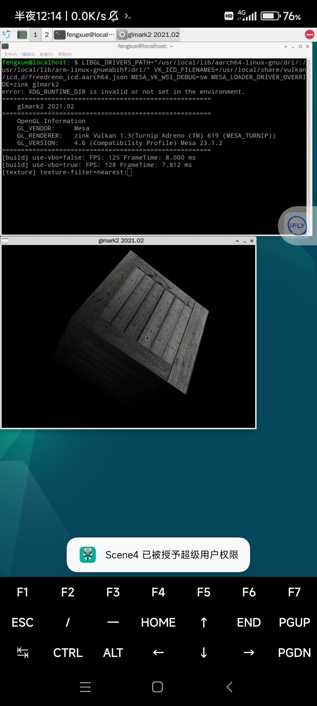
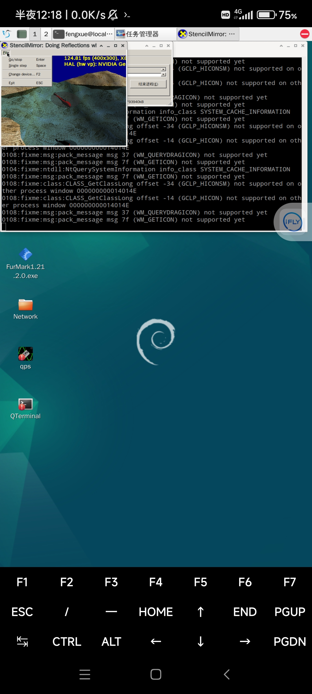
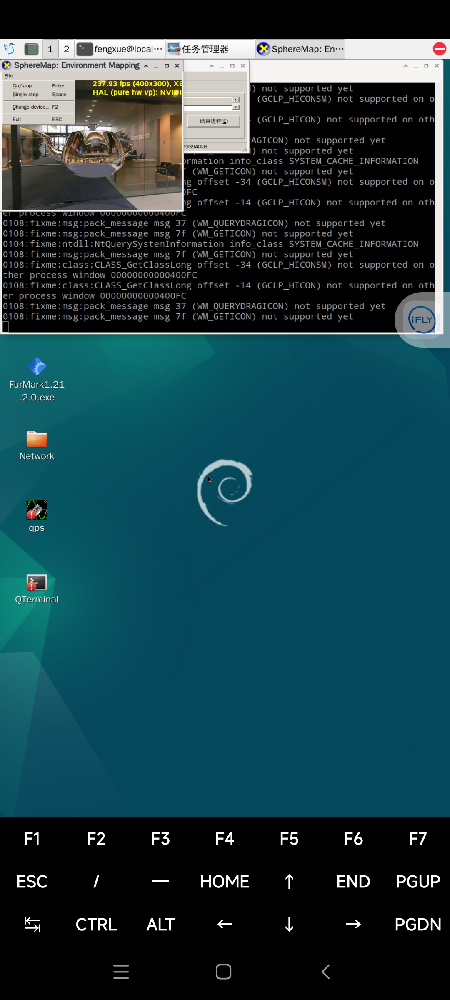

# TurnipAdreno619

#### 介绍
我自己编译的Turnip Adreno (TM) 619,arm64 linux box64 box86 wine可用。

#### 软件架构
此软件源码来自mesa官方，编译了Adreno (TM) 619可用的turnip和zink。

#### 安装教程

1.  sudo dpkg --add-architecture armhf      

    sudo apt update
    sudo apt install libvulkan-dev zlib1g-dev
    sudo apt install zenity:armhf libasound*:armhf libstdc++6:armhf mesa*:armhf
    sudo apt install vulkan* *-mesa-* mesa*
2.  sudo tar -zxvf Turnip-Adreno619.tar.gz -C /usr/local

#### 使用说明

1. 运行opengl程序
    LIBGL_DRIVERS_PATH="/usr/local/lib/aarch64-linux-gnu/dri/:/usr/local/lib/arm-linux-gnueabihf/dri/" VK_ICD_FILENAMES=/usr/local/share/vulkan/icd.d/freedreno_icd.aarch64.json MESA_VK_WSI_DEBUG=sw MESA_LOADER_DRIVER_OVERRIDE=zink glmark2
2. 运行vulkan程序
   LIBGL_DRIVERS_PATH="/usr/local/lib/aarch64-linux-gnu/dri/:/usr/local/lib/arm-linux-gnueabihf/dri/" VK_ICD_FILENAMES=/usr/local/share/vulkan/icd.d/freedreno_icd.aarch64.json MESA_VK_WSI_DEBUG=sw vkcube
3.运行box86 box64 wine
MESA_VK_WSI_DEBUG=sw MESA_LOADER_DRIVER_OVERRIDE=zink box64 wine64 taskmgr​
可同时运行x86和x64 windows exe

#### 参与贡献
     源代码来自mesa3d

1.  Fork 本仓库
2.  新建 Feat_xxx 分支
3.  提交代码
4.  新建 Pull Request

#### 特技

1.  使用 Readme\_XXX.md 来支持不同的语言，例如 Readme\_en.md, Readme\_zh.md
2.  Gitee 官方博客 [blog.gitee.com](https://blog.gitee.com)
3.  你可以 [https://gitee.com/explore](https://gitee.com/explore) 这个地址来了解 Gitee 上的优秀开源项目
4.  [GVP](https://gitee.com/gvp) 全称是 Gitee 最有价值开源项目，是综合评定出的优秀开源项目
5.  Gitee 官方提供的使用手册 [https://gitee.com/help](https://gitee.com/help)
6.  Gitee 封面人物是一档用来展示 Gitee 会员风采的栏目 [https://gitee.com/gitee-stars/](https://gitee.com/gitee-stars/)
